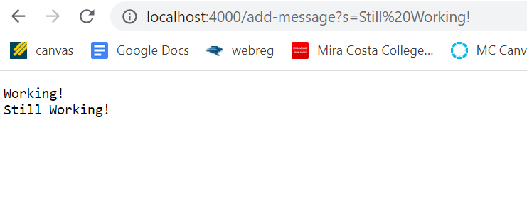
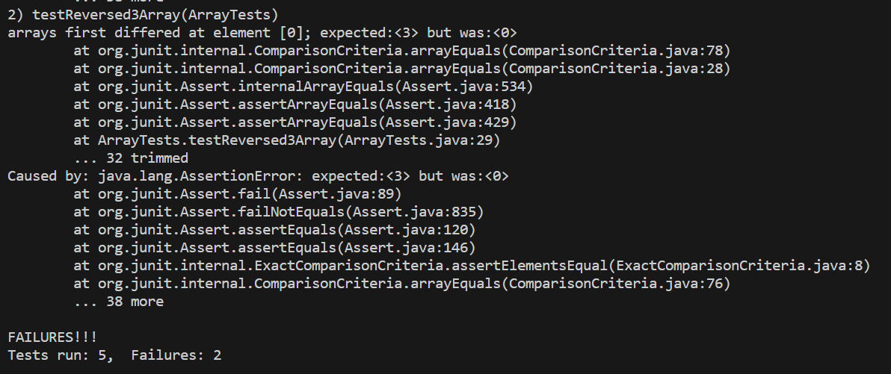

# Lab Report 2
## Description
This lab report includes ceating a Web Server called StringServer which uses the path input from URL to add Strings to the page. It also includes how to identify bugs and what types of inputs cause these bugs. 
## Part 1
Below is the code for String Server. 
Below is the first instance of using /add-message in the path for the Web Server. I used /add-message?s=Working! which displays Working! on the Web Server. 


The first method that is called is Server.start(port, new Handler()) which initially starts the Server. From here, nothing is shown on the website until the path is modified with /add-message and the message the user wants to write in the query. The String variable inputs initially is empty and is added to when the user gives it input. In my above example, I used "Working!" which calls public String handleRequest(URI url). The method takes the website URL and then uses a series of if else statements to determine what is included in the path. In this example, the else staement including url.getPath().equals("/add-message") is run. getPath() takes the path part of the URL and using .equal, compares whether the path includes "/add-message". Since it does, the String array called parameters gets initialized by the method url.getQuery().split("="). This takes the query and splits it into two parts, the first being before the = and the second being after the =. From here, assuming that the query began with s, the message after = is added to the variable inputs. Since this is the first input being given to the server, inputs simply adds the message and then displays the message on the server using String.format(). 

Below is the second instance of using /add-message in the path for the Web Server. I used /add-messages?s=Still Working! which displays Still Working! underneath Working!. For some reason the URL includes %20 where the space should be in between Still Working! I'm assuming this is something the Web Server does by default that replaces spaces. 



Again, the first method that is called is Server.start(port, new Handler()) which initially starts the Server. In my above example, I used "Still Working!" which calls public String handleRequest(URI url). After going through the if else statements, the else staement including url.getPath().equals("/add-message") is run. Again, the query is then split into 2 parts with the message that is going to be added coming after the =. The part that differs this time is that the Web Server already contains a message. Since the Web Server has to keep track of each message that is inputted, inputs is given a newline and then adds the new message. This looks like inputs = inputs + "\n" + parameters[1].

Both examples are ones in which the correct input is given. If the path doesn't include /add-message (for example /add-messaggee), the Web Server instead outputs "404 Not Found!". 

## Part 2
Below is the code that tests the method reversed(int[] arr) in the class ArrayExamples with a failure inducing input. The test named testReversed3Array uses an int array that contains 1,2,3.
```
@Test
  public void testReversed3Array() {
    int[] testArray = {1,2,3};
    assertArrayEquals(new int[]{3,2,1}, ArrayExamples.reversed(testArray));
  }
```

Below is an example of a test of reversed that doesn't use a failure inducing input. the test named testReversed uses an empty int array.
```
@Test
  public void testReversed() {
    int[] input1 = { };
    assertArrayEquals(new int[]{ }, ArrayExamples.reversed(input1));
  }
```

The first test fails but the second test passes as shown in the image below. The failed test states that the value at the first index should be 3 but is instead 0. And since the second test passes, JUnit returns the test as a success. Since I had 5 tests in total, it was one of the 3 tests that passed. 



Below is the code for the method with the bugs in it. Below that is the code with the bugs fixed. There were 2 bugs in the code. The first was that arr was being modified instead of newArray. The second was that the method returned arr but it should be returning newArray.
```
static int[] reversed(int[] arr) {
    int[] newArray = new int[arr.length];
    for(int i = 0; i < arr.length; i += 1) {
      arr[i] = newArray[arr.length - i - 1];
    }
    return arr;
}
```
```
static int[] reversed(int[] arr) {
    int[] newArray = new int[arr.length];
    for(int i = 0; i < arr.length; i += 1) {
      newArray[i] = arr[arr.length - i - 1];
    }
    return newArray;
}
```
