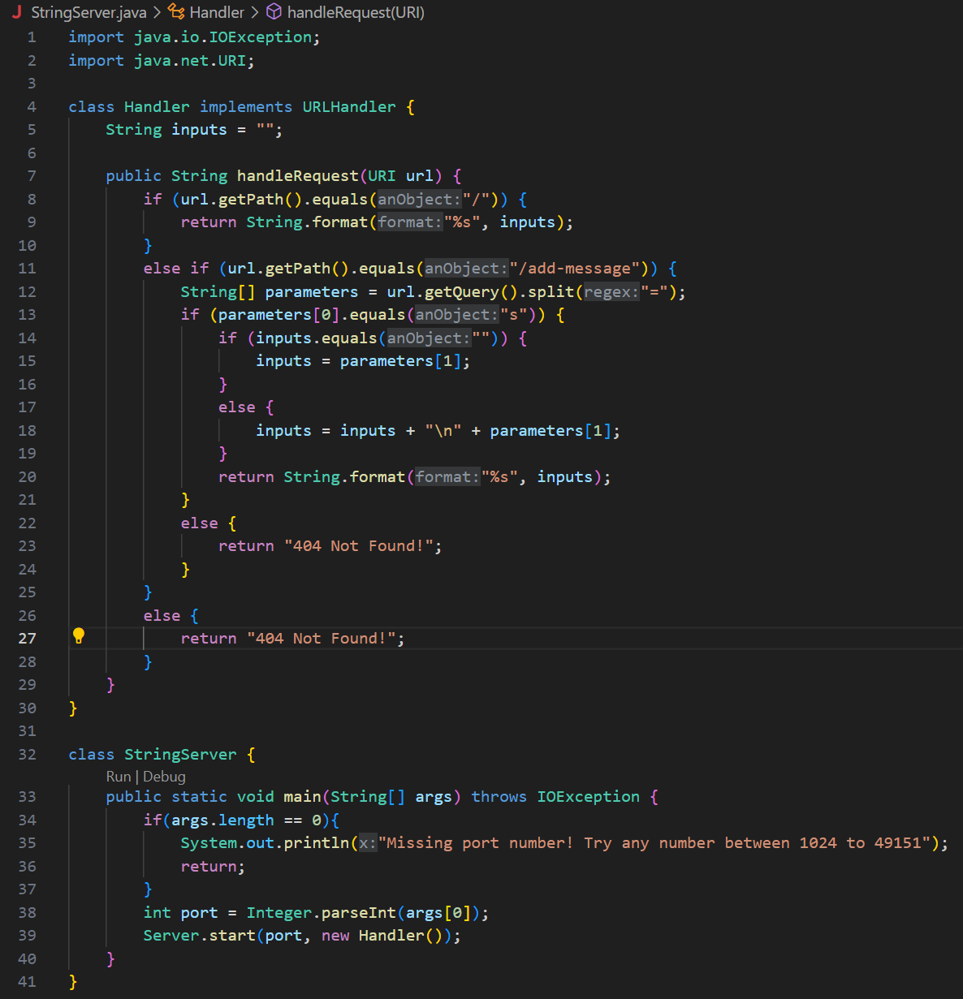
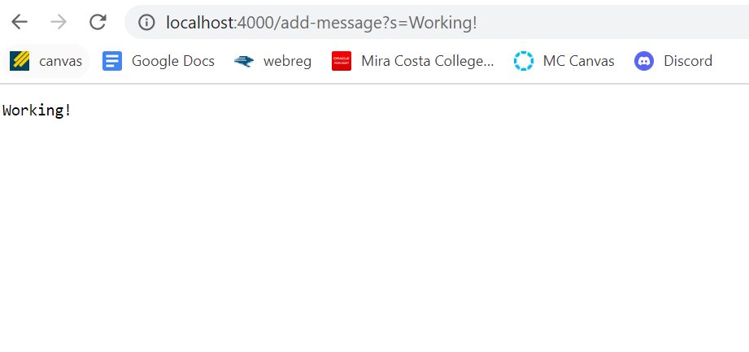

# Lab Report 2
## Description
This lab report includes ceating a Web Server called StringServer which uses the path input from URL to add Strings to the page. It also includes how to identify bugs and what types of inputs cause these bugs. 
## Part 1
Below is the code for String Server. 
Below is the first instance of using /add-message in the path for the Web Server. I used /add-message?s=Working! which displays Working! on the Web Server. 
The first method that is called is Server.start(port, new Handler()) which initially starts the Server. From here, nothing is shown on the website until the path is modified with /add-message and the message the user wants to write in the query. The String variable input initially is empty and is added to when the user gives it input. In my above example, I used "Working!" which calls public String handleRequest(URI url). The method takes the website URL and then uses a series of if else statements to determine what is included in the path. In this example, the else staement including url.getPath().equals("/add-message") is run. 
